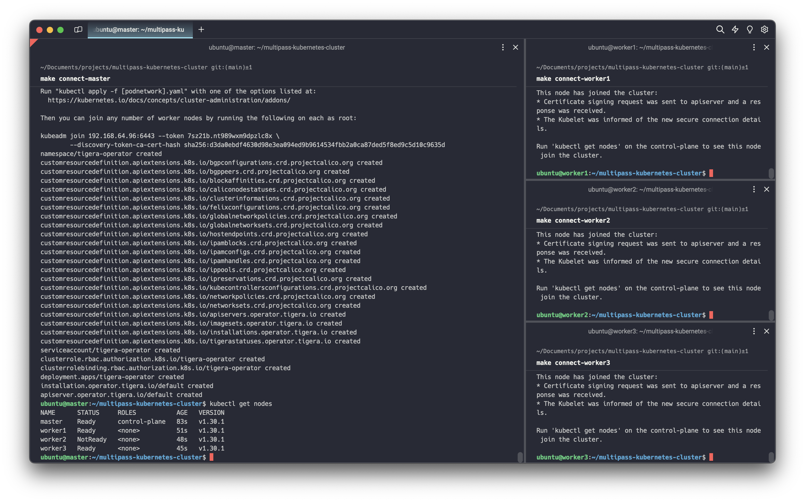

# Kubernetes Cluster Deployment with Multipass


This project provides a Makefile to create a Kubernetes cluster using Multipass. It launches a master node and a specified number of worker nodes.

## Requirements

- [Multipass](https://multipass.run/) must be installed.
- An environment where you can run the `make` command.


## Installation Steps

### Step 1. **Cluster Deployment**: Deploy a 3-node cluster with 1 master and 2 workers.

```bash
make deploy
```

### Step 2. On master pane, 

2.1 Connect to the master node via terminal.

```bash
make connect-master
```

2.2 Install `make`.
```bash
sudo apt install make
```

2.3 Clone the Git repository and navigate into the directory:

```bash
git clone https://github.com/oguzerdo/multipass-kubernetes-cluster.git
cd multipass-kubernetes-cluster
```

2.4 Inside the master terminal, run all the shell scripts.

```bash
make master-install
```

2.5 Copy the output of the join command for worker nodes. It will be something like:
    
```bash
kubeadm join 192.168.64.3:6443 --token al0kvi.x60mi1xj4zesqnq3 --discovery-token-ca-cert-hash sha256:f4ff0c7684bbac599a8208b94bb28e451023662ab51bc1ce16f60a855a85e2a5
```

### Step 3. On worker panes, 

3.1 Connect to each worker node via terminal.
    
```bash
make connect-worker1  # Connect to worker 1
```

3.2 Install `make`.
```bash
sudo apt install make
```

3.3 Clone the Git repository and navigate into the directory:

```bash
git clone https://github.com/oguzerdo/multipass-kubernetes-cluster.git
cd multipass-kubernetes-cluster
```


3.4 For each worker node: Install necessary packages.
        
```bash
make worker-install
```

3.5 Run what you copied from Step 2 with sudo, something like this,

```bash
sudo kubeadm join 192.168.64.44:6443 --token c31uwt.pl4l2h2999snazxt \
	--discovery-token-ca-cert-hash sha256:cf7da133ee8929acfe4650c6f9269299dff36a0b9e97623f141177315153f704
```




### Step. 4 Helm Installation

```makefile
make get-helm
```


### Makefile Targets

- `deploy`: Launches a master node and a specified number of worker nodes. By default, it creates 3 worker nodes.
- `destroy`: Stops, deletes, and purges all Multipass virtual machines.
- `connect-master`: Connects to the master node.
- `connect-worker<NUMBER>`: Connects to the specified worker node.
- `master-install`: Installs containerd, and Kubernetes on the master node.
- `worker-install`: Installs containerd, and Kubernetes on the worker nodes.

### Parameters

- `NODE_COUNT`: Specifies the number of worker nodes to create. The default value is 3.

### Example Usage

To create a Kubernetes cluster with a master node and the default 3 worker nodes:

```bash
make deploy
```

To create a Kubernetes cluster with a master node and a specified number (e.g., 3) of worker nodes:

```bash
make deploy NODE_COUNT=3
```

To connect to the master node:

```bash
make connect-master
```


To connect to a specific worker node (e.g., worker2):

```bash
make connect-worker2
```

To install components on the master node:

```bash
make master-install
```

To install components on the worker nodes:

```bash
make worker-install
```

To destroy all created Multipass virtual machines:

```bash
make destroy
```


 
## OPTIONAL STEPS:


### Assign worker roles

```bash
kubectl label node worker1 node-role.kubernetes.io/worker=worker
kubectl label node worker2 node-role.kubernetes.io/worker=worker
kubectl label node worker3 node-role.kubernetes.io/worker=worker
```

